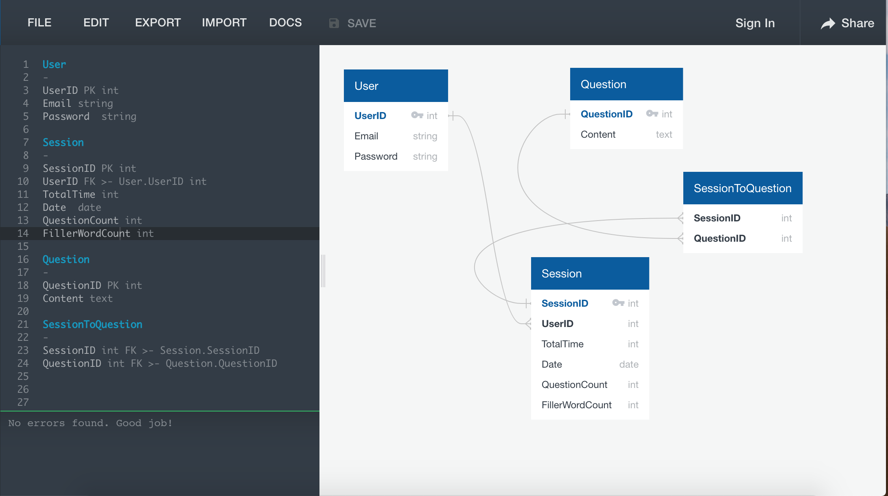

**Interview Coach**

**Overview**
A mobile app with a virtual interview coach that uses AI and Machine Learning to process spoken and visual inputs to provide feedback on interview performance through data visualization & personal recommendations.

**MVP**
A user is presented an interview question and is able to record his/ her answer.
The app takes that audio input and analyzes the content, specifically the use of fillers (‘likes’, ‘ums’, ‘ahs).
The user is then presented with performance feedback through reports and charts based on predetermined metrics.

**Stretch Goals**
- Ability to capture and analyze quality of audio input (speed of speech, volume)
- Ability to capture and analyze visual input (eye contact, smiling)
- Ability to provide feedback on the relevance and quality of the answer
- Store historical data on the user’s performance

**Tech Stack**
- React Native
- Firebase
- Tensor Flow
- Cube.js

**Libraries:**
- React Native Charts (or Victory, Chart.js)
- React-native-voice
- React-native-camera
- Chatbot library
 
**Wireframes**
See complete wireframe through this link.

**Schema Design**
See complete schema through this link.

**Technical Challenges**
- Integrating so many outside libraries
- Getting our data visualizations to look nice
- Implementing ai to provide feedback on the content of users answers

